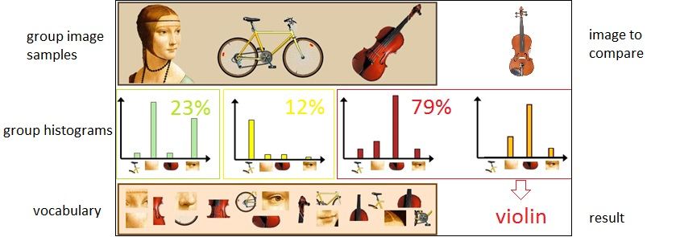
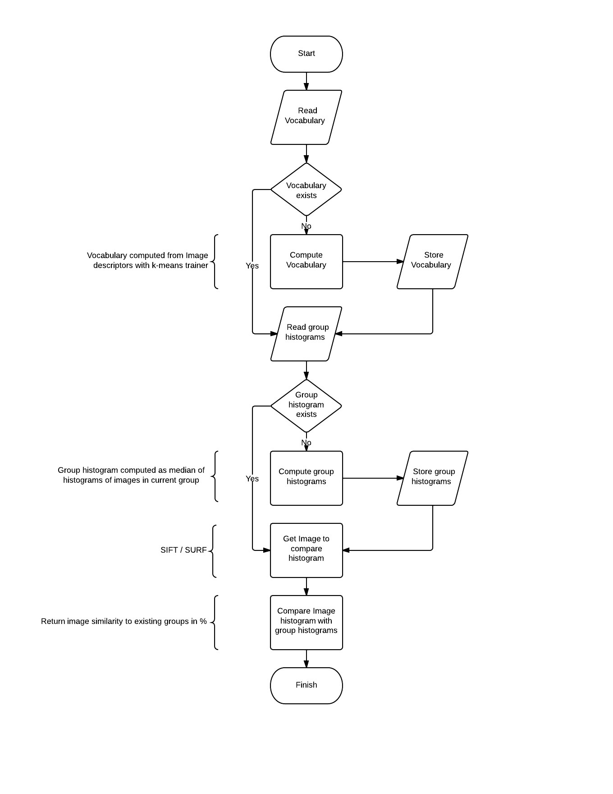

BOW
===

OpenCV + OpenMP used for Bag of Visual Words implementation.

Bag of visual words (BOW) representation was based on Bag of words in text processing. This method requires following for basic user:
* Image dataset splitted into image groups, or
* precomputed image dataset and group histogram representation stored in .xml or .yml file (see XML/YAML Persistence chapter in OpenCV documentation)
* at least one image to compare via BOW

Image dataset is stored in folder (of any name) with subfolders named by group names. In the subfolders there are images for current group stored. BOW should generate and store descriptors and histograms into specified output .xml or .yml file (tested only with XML).

BOW works as follows (compare with Figure 1 and 2):
* compute visual word vocabulary with k-means algorithm (where k is equivalent with count of visual words in vocabulary). Vocabulary is stored into output file. This should take about 30 minutes on 8 CPU cores when k=500 and image count = 150. OpenMP is used to improve performance.
* compute group histograms (there are 2 methods implemented for this purpose – median and average histogram, only median is used because of better results). This part requires vocabulary computed. Group histogram is normalized histogram, this means sum of all columns within the histogram equals 1.
* compute histogram for picture on input and compare it with all group histograms to realize which group image belongs to. This was implemented as histogram intersection.

As seen in Figure 2, whole vocabulary and group histogram computation may be skipped if they were already computed.

For usage simplification I have implemented BOWProperties class as singleton, which holds basic information and settings like BOWDescriptorExtractor, BOWTrainer, reading images as grayscaled images or method for obtaining descriptors (SIFT and SURF are currently implemented and ready to use). Example of implementation is here:

BOWProperties* BOWProperties::setFeatureDetector(const string type, int featuresCount)
{
	Ptr<FeatureDetector> featureDetector;
	if (type.compare(SURF_TYPE) == 0)
	{
		if (featuresCount == UNDEFINED) featureDetector = new SurfFeatureDetector();
		else featureDetector = new SurfFeatureDetector(featuresCount);
	}
...
}

This is how all other properties are set. The only thing that user have to do is simply set properties and run classification.

There is in most cases single DataSet object holding reference to groups and some Group objects that holds references to images in the group in my implementation. Training implementation:

DataSet part:

void DataSet::trainBOW()
{
	BOWProperties* properties = BOWProperties::Instance();
	Mat vocabulary;
	// read vocabulary from file if not exists compute it
	if (!Utils::readMatrix(properties->getMatrixStorage(), vocabulary, "vocabulary"))
	{
		for each (Group group in groups)
			group.trainBOW();
		vocabulary = properties->getBowTrainer()->cluster();
		Utils::saveMatrix(properties->getMatrixStorage(), vocabulary, "vocabulary");
	}
	BOWProperties::Instance()
		->getBOWImageDescriptorExtractor()
		->setVocabulary(vocabulary);
}

Group part (notice OpenMP usage for parallelization):

unsigned Group::trainBOW()
{
	unsigned descriptor_count = 0;
	Ptr<BOWKMeansTrainer> trainer = BOWProperties::Instance()->getBowTrainer();

	#pragma omp parallel for shared(trainer, descriptor_count)
	for (int i = 0; i < (int)images.size(); i++){
		Mat descriptors = images[i].getDescriptors();
		#pragma omp critical
		{
			trainer->add(descriptors);
			descriptor_count += descriptors.rows;
		}
	}
	return descriptor_count;
}

This part of code generates and stores vocabulary. The getDescriptors() method returns descriptors for current image via DescriptorExtractor class. Next part shows how the group histograms are computed:

void Group::trainGroupClassifier()
{
	if (!Utils::readMatrix(properties->getMatrixStorage(), groupClasifier, name))
	{
		groupHistograms = getHistograms(groupHistograms);
		medianHistogram = Utils::getMedianHistogram(groupHistograms, groupClasifier);
		Utils::saveMatrix(properties->getMatrixStorage(), medianHistogram, name);
	}
}

Where getMedianHistogram() method generates median histogram from histograms that are representing each image in current group.

Now the vocabulary and histogram classifiers are computed and stored. Last part is comparing new image with the classifiers. 

Group DataSet::getImageClass(Image image)
{
	for (int i = 0; i < groups.size(); i++)
	{
		currentFit = Utils::getHistogramIntersection(
		groups[i].getGroupClasifier(), image.getHistogram());
		if (currentFit > bestFit){
			bestFit = currentFit;
			bestFitPos = i;
		}
	}
	return groups[bestFitPos];
}

The returned group is group where image most possibly belongs. Nearly every piece of code is little bit simplified but shows basic thoughts. For more detailed code, see sources.